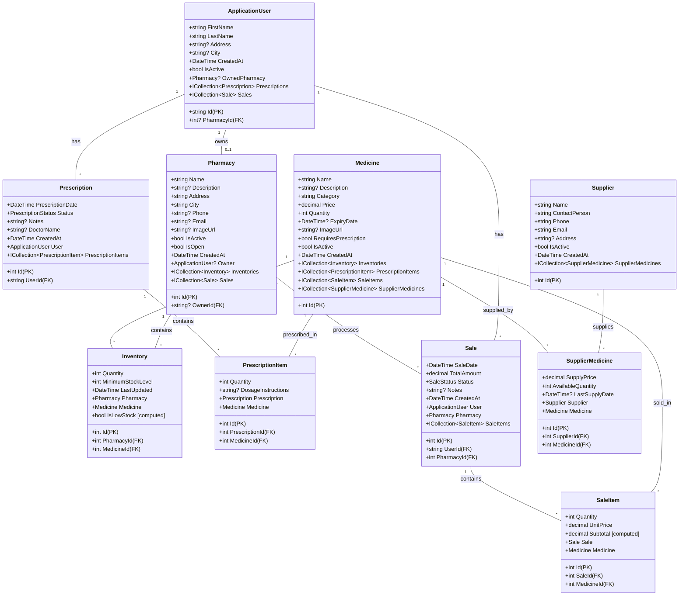

# PharmaLink - Class Diagram

## Domain Models (Exactly 10)

## Relationship Summary

| Type | From | To | Description |
|------|------|----|-------------|
| 1:1 | ApplicationUser | Pharmacy | User owns one pharmacy |
| 1:N | ApplicationUser | Prescription | User has many prescriptions |
| 1:N | ApplicationUser | Sale | User has many sales |
| 1:N | Pharmacy | Inventory | Pharmacy has many inventory items |
| 1:N | Pharmacy | Sale | Pharmacy processes many sales |
| 1:N | Medicine | Inventory | Medicine stocked in many pharmacies |
| 1:N | Medicine | PrescriptionItem | Medicine in many prescription items |
| 1:N | Medicine | SaleItem | Medicine in many sale items |
| 1:N | Prescription | PrescriptionItem | Prescription has many items |
| 1:N | Sale | SaleItem | Sale has many items |
| M:N | Supplier ↔ Medicine | SupplierMedicine | Many suppliers supply many medicines |

## Enumerations

### PrescriptionStatus
- Pending (0)
- Approved (1)
- Dispensed (2)
- Rejected (3)
- Cancelled (4)

### SaleStatus
- Pending (0)
- Completed (1)
- Cancelled (2)
- Refunded (3)